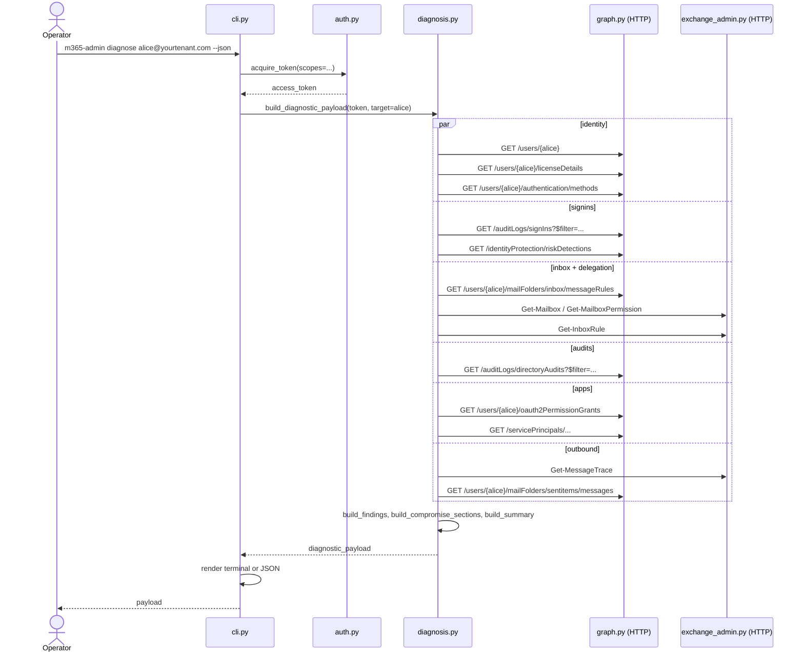
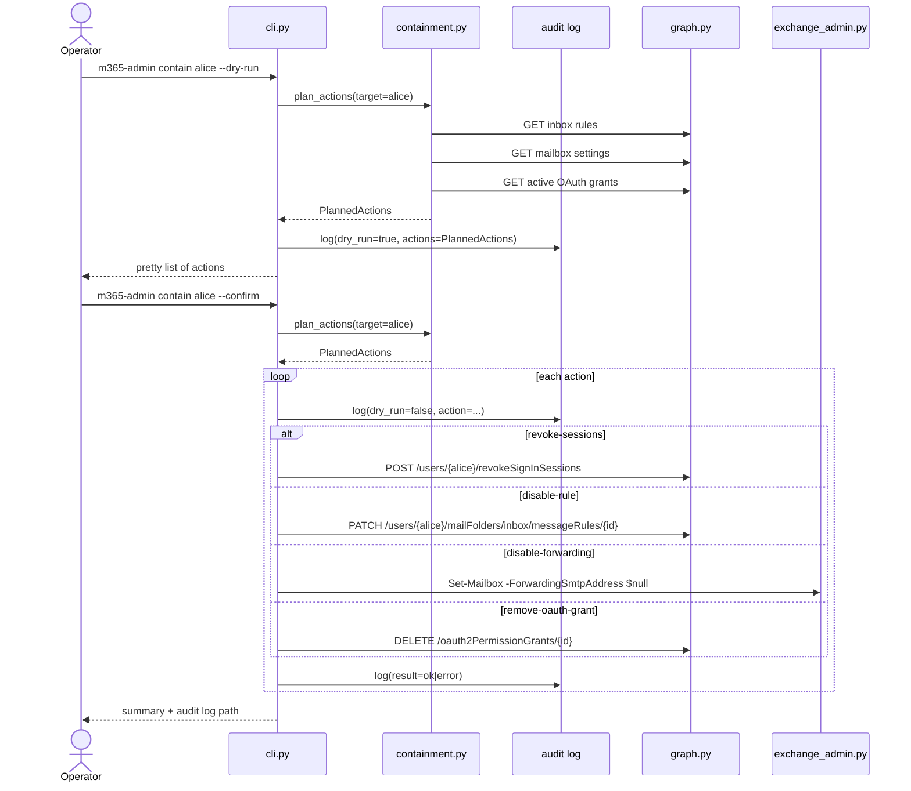

# Architecture

`m365-admin-tool` is built around a small set of design choices that show up everywhere. This doc explains them and walks through the request flow of the canonical `diagnose` command.

## Design choices

1. **One thin client per remote API.** `GraphClient` and `ExchangeAdminClient` are the only modules that touch HTTP. Everything else operates on Graph/Exchange response shapes. The full test suite runs against JSON fixtures.

2. **Detections are pure functions.** Each detection takes a list of Graph objects and returns a list of `Finding` instances. No I/O inside detection code, which means each one is trivially unit-testable.

3. **Graceful degradation.** `diagnose` runs each data section in isolation. A failure in message trace doesn't abort the run — the section is marked `unavailable` with a reason, and investigation continues.

4. **JSON-first output.** The default human-readable output is rendered from the same payload `--json` emits, so anything you see in the terminal can be piped through `jq`.

5. **Containment is opt-in and audited.** Write actions are off unless `--confirm` is set, and every action is logged with timestamp, operator UPN, target UPN, action, and Graph correlation ID — both in `--dry-run` mode (so you can review) and in confirmed runs (so you have a forensic trail).

## Module dependency graph

```mermaid
flowchart TD
    cli[cli.py]
    auth[auth.py]
    config[config.py]
    graph[graph.py]
    exch[exchange_admin.py]
    doctor[doctor.py]
    diag[diagnosis.py]
    iden[identity.py]
    inv[investigation.py]
    out[outbound.py]
    cont[containment.py]
    tl[timeline.py]

    cli --> auth
    cli --> config
    cli --> doctor
    cli --> diag
    cli --> tl
    cli --> cont
    cli --> inv
    cli --> out

    doctor --> graph
    doctor --> auth
    doctor --> config

    diag --> graph
    diag --> exch
    diag --> iden
    diag --> inv
    diag --> out

    iden --> graph
    inv --> graph
    out --> graph
    out --> exch
    cont --> graph
    cont --> exch
    tl --> graph
    tl --> exch

    auth --> config
    graph --> config
    exch --> config
```

## `diagnose` sequence

The canonical workflow command. Single user, single invocation, structured payload out.



Each parallel branch is a separate section in the output. A branch that fails (missing scope, throttling, Graph 5xx, propagation delay) is recorded in `unavailableEvidence` rather than aborting the run.

## `contain` sequence



## Failure modes the design handles

- **Missing scope.** The Graph wrapper recognizes `Authorization_RequestDenied` and `InsufficientPrivileges` and produces a `GraphApiError` with the missing scope in the message. `diagnose` catches and degrades; `contain` aborts the specific action and continues.
- **Throttling / 429.** The wrapper backs off using the `Retry-After` header. Each detection has a per-call timeout so a stuck request can't hang the whole run.
- **Propagation delay** (newly-created Exchange app registration). `doctor` detects this and recommends waiting or re-running. `diagnose` records it as `unavailableEvidence` rather than reporting absence-of-forwarding as evidence-of-no-forwarding.
- **Pagination.** Both clients follow `@odata.nextLink` automatically. No detection has to know about it.
- **Multi-tenant operators.** `tenants.json` lets a single install switch between tenant profiles. Token cache is per-profile; cross-tenant pollution can't happen.

## Test strategy

```
tests/
├── test_auth.py           # MSAL account selection, scope mapping
├── test_cli.py            # Argument parsing, command dispatch, output rendering
├── test_diagnosis.py      # Findings, compromise sections, outbound summary
├── test_doctor.py         # Pre-flight check evaluation
├── test_investigation.py  # Sign-in normalization, rule analysis, OData filters
└── test_outbound.py       # Message trace error analysis, sender-mismatch detection
```

Every test runs against in-memory fixtures. No network. No MSAL token acquisition. The result is a sub-second test suite that catches the same bugs as a slower integration suite would.
