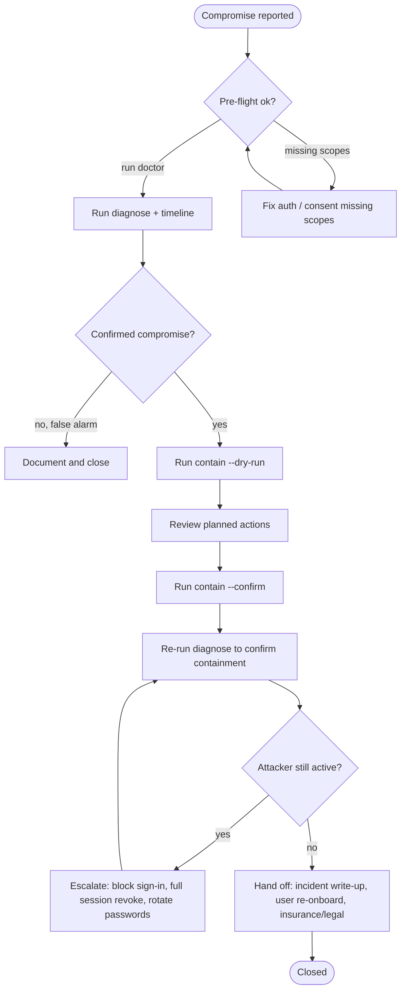

# M365 Compromised-User Triage Playbook

This is the incident-response sequence that `m365-admin-tool` is built around. It assumes the compromise is already confirmed (the user reported a suspicious sign-in alert, security training caught a phish, a third party flagged outbound BEC mail, etc.) and the goal is **containment + evidence collection in the first hour**.

It is _not_ a hunting playbook — for that, you want Defender, Sentinel, or a real SIEM. This is the "you have to clean this up right now" playbook.

## Decision flow



## Phase 1 — Pre-flight (target: under 2 minutes)

```bash
m365-admin doctor --target alice@yourtenant.com
```

What this checks:

- Tenant profile loads cleanly, MSAL can acquire a token
- Each Graph endpoint the workflow needs responds 2xx with the scopes you have
- Exchange Admin API is reachable (for mailbox forwarding inspection)
- The target user exists and isn't already disabled
- Optional helper fixes for known-good auto-fixable issues (`--fix`)

If `doctor` is red on a scope you'll need, fix it now. Investigation that misses message trace or risk-detection results is **worse than no investigation** because it leads to a false negative.

## Phase 2 — Detect (target: under 5 minutes)

```bash
m365-admin diagnose alice@yourtenant.com --json > evidence/alice-diagnose.json
m365-admin timeline alice@yourtenant.com --hours 24 --json > evidence/alice-timeline.json
```

The diagnose payload separates four classes of evidence so you can act on the strongest ones first and document the gaps:

| Field                           | What's in it                                                                                                                                                                                       |
| ------------------------------- | -------------------------------------------------------------------------------------------------------------------------------------------------------------------------------------------------- |
| `confirmedCompromiseIndicators` | Things that are concrete proof of compromise (hidden inbox rule, OAuth grant in the last 24h with risky scope, SMTP forwarding to external domain, risky sign-in confirmed by Entra ID Protection) |
| `suspectedIndicators`           | Anomalies that need a human (atypical user agent, unusual download burst, sign-in from new ASN)                                                                                                    |
| `remediationAlreadyTaken`       | What's already been done to the account — important so you don't undo someone else's fix                                                                                                           |
| `unavailableEvidence`           | Data you couldn't collect (missing scope, throttled API, propagation delay) — name the gap so the write-up reflects reality                                                                        |

If `confirmedCompromiseIndicators` is empty but `suspectedIndicators` has entries, **do not contain yet**. False-positive containment burns trust with the user and the org. Run drill-downs (`signins`, `apps`, `rules`, `outbound-review`) to either confirm or rule out.

## Phase 3 — Contain (target: under 10 minutes)

Always start with the dry run:

```bash
m365-admin contain alice@yourtenant.com --dry-run
```

This lists every action the tool would take, the Graph endpoint it would call, and the rule/grant/session it would target. Read it. Don't skip this step even when you're confident.

Then commit:

```bash
m365-admin contain alice@yourtenant.com --confirm
```

Default contain sequence:

1. **Revoke sign-in sessions** — `revokeSignInSessions`. Kills refresh tokens; legitimate clients prompt for re-auth, attacker tokens become useless.
2. **Disable inbox rules with external forwarding/redirect.** Disable rather than delete so the rule survives for forensics.
3. **Disable mailbox SMTP forwarding.** Clears `forwardingSMTPAddress` and `forwardAndSaveOnForward`.
4. **Revoke recently-consented OAuth grants** flagged as suspicious. Both delegated grants and app-role assignments.
5. **Force password reset** by setting `passwordPolicies` to require change next sign-in.
6. **Reset MFA methods** so the user must re-enroll.

The tool will **not** automatically delete the user, block sign-in, or hard-delete mailbox rules. Those are escalation moves that require a human decision.

## Phase 4 — Validate (target: under 5 minutes)

```bash
m365-admin diagnose alice@yourtenant.com --json
```

Confirm:

- Sign-in sessions revoked (no active sessions; user has to re-auth)
- Inbox rules disabled (forensic copies still present, hidden rules surfaced)
- SMTP forwarding cleared
- OAuth grants removed from the user's view (and the app, if uniquely consented)
- Password reset enforced on next sign-in
- MFA methods are empty (user must re-enroll)

If `diagnose` still shows suspected indicators after containment — for example, sign-ins continuing from the attacker IP — escalate to **block sign-in** (`accountEnabled: false`) and rotate the user's password from the admin side. That stops everything but locks the user out, so brief them first.

## Phase 5 — Handoff

Everything from Phases 2–4 lives in `evidence/`. The structured JSON is what you hand to:

- The user, with a clear explanation of what happened, what was stopped, and what they need to do (re-enroll MFA, re-sign-in everywhere, check sent items)
- Your ticketing system as the incident artifact
- Cyber insurance / legal if the compromise touched financial data or PII
- The org's wider security posture review — was this avoidable? was MFA a phish-resistant method? do conditional access policies block legacy auth?

## What's intentionally not automated

A confidently-wrong automation in incident response is more dangerous than a slow human. The following are deliberately manual:

- **Hard-deleting inbox rules.** Disable for forensics; delete after the write-up is signed off.
- **Hard-deleting OAuth apps.** Revoke grants per-user; the org-level cleanup is a separate decision.
- **Blocking sign-in.** Locks out the legitimate user; requires explicit approval.
- **Mass containment across multiple users.** Each user gets their own `contain` invocation with explicit confirmation. Bulk operations get reckless fast.

## Known limitations

- **Message trace can lag.** A newly-created Exchange app registration may need 5–30 minutes for the Transport Data Platform service principal to propagate. `doctor` surfaces this explicitly.
- **Delegated auth cannot read another user's mailbox.** For cross-user investigations, app-only auth with `M365_CLIENT_SECRET` is required.
- **Exchange Admin API needs `Exchange.ManageV2` or `Exchange.ManageAsAppV2`.** Without one of these the mailbox delegate / forwarding snapshot will degrade gracefully but you lose that evidence.
- **Audit log retention.** Tenants on Business Standard get 180 days of audit log by default; older incidents may not have evidence available at all. Name the gap in the write-up.
